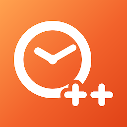

# Volume++

Volume++ is a native Android app that replaces the stock system volume panel with a fully
custom, themeable one, and adds per-app volume mixing that Android doesn't normally expose to
the user.

<p align="center">
  
  
  
</p>

<p>
  <a href="https://play.google.com/store/apps/details?id=com.alarmplusplus.app"></a>
  Also by me: <a href="https://play.google.com/store/apps/details?id=com.alarmplusplus.app"><b>Alarm++</b></a> — an alarm clock that wakes you with your own videos.
  <a href="https://play.google.com/store/apps/details?id=com.alarmplusplus.app"></a>
</p>

## What it does

Android's real volume panel is a single, fixed UI tied to whatever version of Android you're
running, and it only lets you control per-stream volume (media / ring / alarm / notification) —
never individual apps. Volume++ replaces that panel outright and fills in both gaps:

- **A custom volume panel that intercepts the hardware volume keys.** An Accessibility Service
  captures volume-up/volume-down presses before the system does, suppresses the stock panel, and
  draws its own floating overlay instead — with the same press-and-hold ramping behavior as the
  real thing.
- **Faithful recreations of every major Android volume-panel design, Android 7 through 15.**
  The overlay isn't one fixed look — it can render the classic Android 7/8 top sheet, the
  Android 9–11 collapsed-edge-control-plus-"Sound"-sheet layout, Material You's Android 12 panel,
  and the Android 13/14/15 "Sound & vibration" sheet (including Android 15's redesigned
  "Audio will play on" media-output picker). You pick which version's panel you want, independent
  of the Android version actually installed on the device.
- **A live, on-screen WYSIWYG editor** for repositioning every panel component (main panel,
  expanded sheet, output picker) per orientation by dragging it around the screen, and a color
  editor that lets you tap any element of the panel — background, slider fill/track, icons,
  accent, text, buttons — to recolor it, independently for each Android-version skin. Colors can
  be dialled in on a wheel or lifted straight off the screen with the **eyedropper**.
- **Per-app volume mixing**, via [Shizuku](https://github.com/RikkaApps/Shizuku) *or root*: the
  panel can show one volume slider per currently-playing app (not just per stream) and set that
  app's actual playback volume using a hidden system API, plus toggle whether an app is allowed to
  take audio focus at all — i.e. whether it's allowed to pause everything else when it starts
  playing, which is what makes true audio mixing between two apps possible.
- Per-app volume choices are remembered for the life of a playback session and silently
  re-applied as the app's audio players churn (e.g. across screen off/on or backgrounding), so a
  level you set doesn't reset back to full the next time the app makes a sound — it only resets
  once the app's process is actually gone.
- **Four languages**, picked in the app or followed from the device: English, Español, Português
  and Français.

## The volume panel, Android 7 → 15

One app, nine panels. Each one is picked in **Overlay → Style**, and each keeps its own position
and its own colors, so switching between them doesn't disturb anything you've set up on the others.

*(Every shot below comes from one Android 9 device running one build of Volume++. The panel style
is the app's, not the system's — which is the whole point.)*

|                        Android 7                        |                        Android 8                        |                        Android 9                        |
| :-----------------------------------------------------: | :-----------------------------------------------------: | :-----------------------------------------------------: |
|  |  |  |
|                     **Android 10**                      |                     **Android 11**                      |                     **Android 12**                      |
|  |  |  |
|                     **Android 13**                      |                     **Android 14**                      |                     **Android 15**                      |
|  |  |  |

They expand, too. Android 9 and up open a full sheet carrying every stream and one slider per
playing app — including Android 15's "Audio will play on" media-output card — while the Android
7–8 panel grows in place to add its Ring and Alarm rows:

<p align="center">
  
  
  
</p>

## Inside the app

The app itself is three tabs.

### Volume

Stock-style sliders over the system's own streams — media, call, ring, notification and alarm.
It needs no privileged helper and no setup, and it tracks the hardware keys live, so it stays in
sync with whatever else changes the volume. The Notification row greys out while the ringer is
silenced, because notifications can't make a sound then anyway; and if Do Not Disturb blocks a
ring change, the tab offers the access screen rather than failing quietly.

### Mixing

One switch per app: turn it on and that app keeps playing when something else starts. The tab
needs a privileged helper — **Shizuku or root** — and walks you through whichever one you pick
with a checklist that ticks itself off as you go.

It also carries the fix for a side effect of sideloading: a build installed from GitHub records
whichever browser or file manager opened it as its install source, which some banking apps flag as
an "unofficial app store". One tap has the privileged helper reinstall the same APK in place with
Google Play recorded as the installer — app data, granted permissions and the accessibility
service all survive. The card only appears while the source still looks sideloaded.

|                       Setup checklist                        |                        App list                        |
| :----------------------------------------------------------: | :----------------------------------------------------: |
|  |  |

### Overlay

Where the panel is set up and styled: the three permission grants, the switch that hands the
volume keys back to Android, the style picker (Android 7 → 15, each with its own editor), the
motion and haptics settings, and an option to point the panel's SETTINGS / SEE MORE button at
Volume++ instead of Android's Sound settings.

|                        Permissions                         |                          Styles                           |                        Motion & haptics                    |
| :--------------------------------------------------------: | :-------------------------------------------------------: | :--------------------------------------------------------: |
|  |  |  |

## Editing a panel

Each style in the list has its own **Edit** button, and everything you change there is stored
against that style alone.

|                       Edit hub                        |                    Position editor                    |                     Colour editor                     |
| :---------------------------------------------------: | :---------------------------------------------------: | :---------------------------------------------------: |
|  |  |  |

- **Position** — the real panel is drawn on a dimmed backdrop and dragged where you want it, once
  per orientation. Every component moves independently: the main panel, the expanded sheet, and
  (on Android 15) the media-output picker.
- **Colours** — tap any part of the panel to recolor it: background, slider fill and track, icons,
  accent, text, buttons. Colors are shared across orientations, so they're edited in whichever way
  the device happens to be held.
- **Restore defaults** — **Restore default position** puts every one of that style's panels back
  where it docks (both orientations), and **Restore default colours** drops its colour overrides.
  Each undoes only its own half, and neither touches any other style.

### The eyedropper

Instead of dialling a colour in, lift one off the screen. **Pick from screen** puts Volume++ out of
the way and leaves a floating pill behind, so you can go anywhere on the device — another app, a
photo, the wallpaper — and grab that frame. The frame then freezes under a magnifier loupe, and you
drag it to the exact pixel you want.

<p align="center">
  
  
</p>

## How audio mixing works

Normally, when one app starts playing sound, Android asks whichever app was already playing to
pause or go quiet — this is called **audio focus**. It's why starting a YouTube video pauses
Spotify. Mixing makes an app ignore those requests, so its sound keeps playing on top of
everything else.

Under the hood, the Mixing tab flips the `TAKE_AUDIO_FOCUS` app-op for the app you toggle, via the
privileged helper (`appops set <package> TAKE_AUDIO_FOCUS ignore`). With that op ignored, the
app's focus requests are silently dropped by the system, so nothing else is ever told to duck
or pause on its behalf.

**Using it:**

- Turn on the switch for the app you want to *keep hearing* — for example, enable YouTube to keep
  hearing it while Spotify plays.
- Enabling just one of the two apps is enough; you don't need to toggle both.
- Restart playback in that app for the change to take effect.

**Caveats:**

- With audio mixing on, some apps may freeze, replay ads, or lose their pause/resume controls
  (media buttons and notification controls are wired to the focus system too). If an app
  misbehaves, turn its switch off to go back to normal.
- Mixing runs through the Volume++ panel, so the Mixing tab is disabled while **Use system volume
  control** is on in the Overlay tab. Turn that switch off to re-enable mixing.
- A privileged helper (Shizuku or root) must be running, since the app's own UID isn't allowed to
  change another app's app-ops.

## Shizuku or root

Everything privileged — per-app volume, the audio-focus toggle, silent-without-DND — runs through
one helper process, and there are two ways to get one:

- **Shizuku** spawns it at the shell UID. It needs the [Shizuku](https://github.com/RikkaApps/Shizuku)
  app, its service started over ADB or wireless debugging, and a one-time authorisation.
- **Root** spawns it with `su` instead — one tap, no ADB and no third-party app. Offered
  automatically when the device looks rooted (Magisk, KernelSU, APatch, SuperSU or a plain `su`
  binary).

Both routes end at the same service over the same interface, so nothing else in the app knows or
cares which one is live. Neither is required to use the panel itself: without one, Volume++ still
replaces the system panel and controls the ordinary system streams.

## Motion, haptics and the ringer

- **Motion** — two sliders (50–200%) scale the panel's easing while a volume key is held: how fast
  it *follows* your presses, and how softly it *settles* afterwards. 100% is the stock feel. The
  same glide runs on all nine skins, and dragging a slider trails your finger by a tuned amount
  rather than snapping to it, settling smoothly once you let go.
- **Haptics** — an optional light tap on every volume step, whether the step came from holding a
  key or from dragging a slider, with its own intensity slider (50–200%) that plays a live sample
  as you move it.
- **ⓘ on every setting** — each motion and haptics control carries an info button explaining, in
  plain language, what it changes.
- **Silent doesn't drag Do Not Disturb along.** On the Android 9–15 panels, choosing silent mutes
  the ringer and notification volume and leaves Do Not Disturb exactly where it was — the
  framework's usual "external" ringer path switches DND on unconditionally, so Volume++ routes
  around it (through the privileged helper where available, and by muting the ring stream where
  it isn't). The Android 7–8 panel behaves as it always has.
- **Use system volume control** — a switch that hands the volume keys straight back to Android.
  The overlay never opens while it's on, the style section greys out, and the Mixing tab (which
  rides on the panel) is blocked with a shortcut back to this switch.

## Languages

Volume++ ships English, Español, Português and Français, and follows the device language by
default. The globe in the top bar overrides that at any time; the choice applies immediately,
overlay included.

<p align="center">
  
</p>

Translations are plain Kotlin files with a per-key English fallback, so a partial translation is
perfectly usable — adding a language is two edits, documented in [docs/TRANSLATING.md](docs/TRANSLATING.md).

## Release history

### 1.1.5

- **Restore defaults** in each style's edit hub — **Restore default position** and **Restore
  default colours**, each confirmed before it runs and reported back with a snackbar, and each
  undoing only its own half.
- **ⓘ explanations** on every motion and haptics setting, and the haptic intensity slider now
  plays a live sample as you drag it.
- **Smoother sliders everywhere** — the held-key glide runs on all nine skins instead of just the
  Android 12–15 ones, and dragging trails your finger rather than snapping to it, settling once
  released.
- **Step haptics on slider drags too**, not just held keys, plus a fix for a race that silently
  suppressed the held-key tap for the whole hold.
- **Point the panel's SETTINGS / SEE MORE button at Volume++** instead of Android's Sound
  settings — off by default, offered on the Android 9–15 styles.
- **Fix for banking apps flagging Volume++ as an unofficial install**, by relabelling a sideloaded
  build's install source in place.

### 1.1.3

- **Screen eyedropper** in the colour editor — pick a colour from anywhere on the device
  (MediaProjection + a magnifier loupe), and colour selection fixes alongside it.
- **Root mode** as a full alternative to Shizuku for the privileged service, offered automatically
  on rooted devices.
- **Multi-language support** with an in-app language picker: English, Español, Português,
  Français, plus a translator's guide.

### 1.1.0

- **Audio mixing**: a whole tab of per-app `TAKE_AUDIO_FOCUS` switches, so two apps can play at
  once, with the blocking **Use system volume control** setting spotlit from the Mixing tab.
- **Silent no longer enables Do Not Disturb** on the Android 9–15 panels — it only mutes ringer and
  notification volume. Android 7–8 behaviour is unchanged.
- **Use system volume control** switch, handing the volume keys back to Android's own panel.
- **Smoother overlay motion** on steps and drags, plus optional subtle haptics while holding
  (thanks [@JoshDoesStuff](https://github.com/JoshDoesStuff)).

### 1.0.0

- The custom volume panel, the Android 7–15 skins, the position and colour editors, and per-app
  volume through Shizuku.

## How it works

- **`VolumeKeyService`** — an `AccessibilityService` that grabs `KEYCODE_VOLUME_UP` /
  `KEYCODE_VOLUME_DOWN` and drives the overlay instead of letting them reach the system panel.
- **`OverlayController`** — builds and animates the floating panel window
  (`SYSTEM_ALERT_WINDOW`) for whichever Android-version skin is selected, including the live
  position/color editor modes.
- **`PrivilegedManager` / `UserService`** — the single entry point for everything privileged. It
  gets a privileged process going through Shizuku (shell UID) or libsu (root), binds the same
  `IUserService` inside either one, and exposes the calls the app's own UID isn't allowed to make:
  `appops set <pkg> TAKE_AUDIO_FOCUS …`, the internal ringer-mode setter, the in-place
  `pm install -r -t -i com.android.vending` reinstall that relabels a sideloaded install source,
  and hidden `AudioManager`/`AudioPlaybackConfiguration` APIs for per-player volume, activity and
  process liveness.
- **`StepHaptics`** — the one tuned buzz behind every volume step, shared by the held-key repeat
  and by slider drags so both feel identical at any intensity.
- **`ScreenColorPicker` / `ColorPickService`** — the eyedropper. A `mediaProjection` foreground
  service holds the capture session open while the user goes hunting for a colour in another app;
  the grabbed frame is frozen under a magnifier loupe for the actual pick.
- **`AppRepository`** — enumerates every installed app (not just launchable ones) as candidates
  for the mixing toggle, with known music/video apps sorted to the top.
- **`AppConfig` / `AppSettings` / `Strings`** — build-time configuration, the user's saved theme
  and language, and the translations themselves.

## What it's built on

- **[Shizuku](https://github.com/RikkaApps/Shizuku)** (`dev.rikka.shizuku`) and
  **[libsu](https://github.com/topjohnwu/libsu)** (`com.github.topjohnwu.libsu`) are the two
  foundations that make per-app volume and audio-focus control possible — one without root, one
  with. Both are real dependencies the app binds to at runtime, not just inspirations.
- The volume-panel skins are original re-implementations of AOSP/SystemUI's own volume dialog
  designs from each Android release (7 through 15) — built from scratch in Compose/Views to look
  and animate like the real thing, not copied from another app's source.
- Everything else (UI, overlay engine, mixing logic, per-app session persistence, the eyedropper,
  the translations) is original code written for this project.

## Tech stack

- Kotlin, Jetpack Compose + Material 3 for the in-app UI (volume screen, mixing screen, overlay
  style/editor screen)
- Classic Android views (`WindowManager`, custom drawables/animations) for the overlay panel
  itself, since it has to be drawn outside the app's own window
- AIDL (`IUserService`) for the privileged process, hosted by either Shizuku or libsu's `RootService`
- `MediaProjection` + a foreground service for the screen eyedropper
- Kotlin coroutines for the async privileged calls and the per-app re-apply polling loop
- `minSdk 24` (Android 7.0) / `targetSdk 36`

## Permissions & requirements

- **Shizuku or root** for the Mixing tab and per-app sliders; without either, the app still runs
  and shows the custom panel with system stream volumes only. (Per-app sliders additionally need
  Android 13+.)
- **Accessibility service** — required to intercept the hardware volume keys.
- **Display over other apps** (`SYSTEM_ALERT_WINDOW`) — required to draw the custom panel.
- **Notification policy access** — lets ring/notification volume be changed even under Do Not
  Disturb.
- **Screen capture** — asked for only when the eyedropper is used, and only for as long as it runs.
- `QUERY_ALL_PACKAGES` is used to list every installed app for the mixing toggle, which makes
  this an off-Play-Store build (sideload/F-Droid-style distribution only).

## Building

```
./gradlew assembleDebug
```

The APK is a standard Gradle Android project (`app` module); open it in Android Studio or build
from the command line with the wrapper above.

## Translating

Adding a language is two edits and needs no build-system changes — see
[docs/TRANSLATING.md](docs/TRANSLATING.md).

## AI disclosure

AI-assisted development tools were used in building this app — for writing and refactoring code,
and for parts of this documentation. The design decisions, the testing on real devices, and the
final review of everything that shipped are the author's own.

## License

MIT — see [LICENSE](LICENSE).
